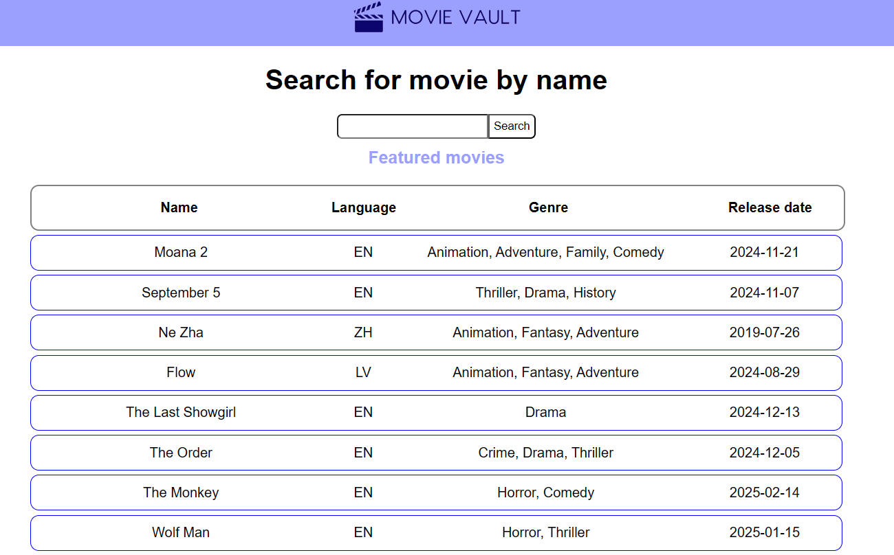
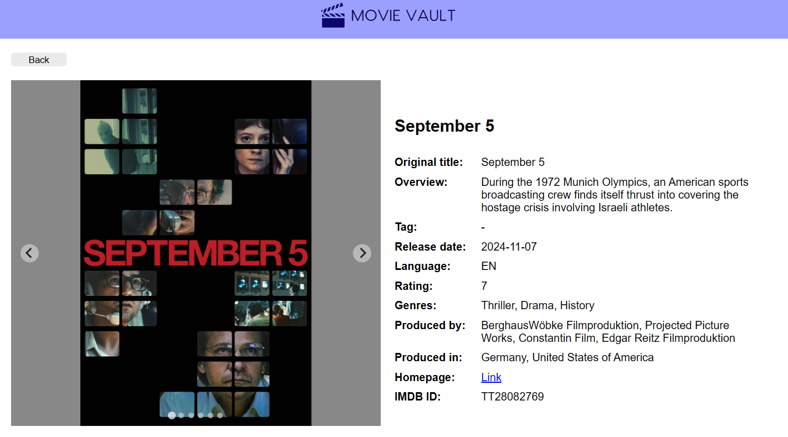

# MovieVault

MovieVault is a feature-rich movie browsing platform built using React and styled with SASS. The website provides a seamless user experience with dynamic content, safety, and responsive layouts.

## Features

**Browse Featured Movies** - Fetch and display featured movies dynamically.

**Search Functionality** - Search for movies in real-time.

**Movie Data** - Get information about trending or specific movie.

**Responsive Design** – Optimized for all screen sizes using Tailwind CSS.

**Proxy Server** - Protecting API key and handling custom requests.


## Technologies Used

- React

- Redux (RTK)

- React Router

- TypeScript

- SASS

- Nest.JS

## Setup & Installation

### Prerequisites

Ensure you have Node.js (>=16) and npm (>=8) installed.

### Installation Steps

1. Clone the repository
  ```
  git clone https://github.com/your-username/movievault.git
  cd movievault
  ```

2. Install dependencies

*Make sure you start at /MovieVault*
```
npm install
cd proxy; npm install
```

3. Run the development server

`npm run development` - Run both proxy server and web app

Access web app at - [http://localhost:5173/](http://localhost:5173/)

---

4. (Optional) Building for Production

*If you would like to generate production files again*

```

npm run build

cd proxy

npm run build

cd ..

```

This will generate a dist/ folder containing builds in both folders.

5. Serve the built project:

`npm run production` - Launched from /movievault

Access production version - [http://localhost:4173/](http://localhost:4173/)

Proxy server can be tested at - [http://localhost:3000/](http://localhost:3000/)

## Testing

In root directory use `npm run test` to access web page with testing data. **Must launch proxy server first!**

## Usage

On first visit, featured movies list will appear. 


Clicking on movie opens detailed page

